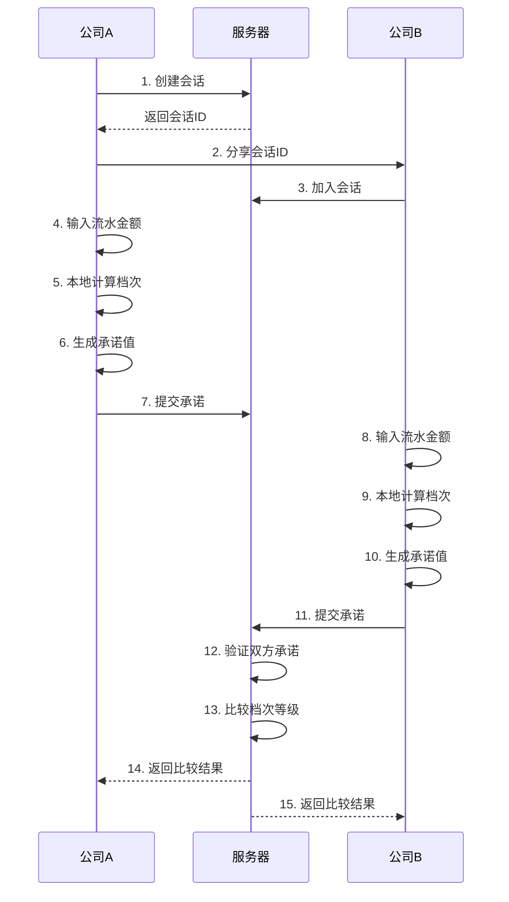

# 🏢 企业流水安全比较系统

基于密码学安全多方计算的企业信用评级比较系统。两家公司可以在**不泄漏具体流水金额**的情况下，比较彼此的信用档次，验证对方不是空壳公司。

## 📖 项目背景

### 百万富翁问题

在密码学中，有一个著名的"百万富翁问题"（Yao's Millionaires' Problem）：两个百万富翁想知道谁更富有，但都不想透露自己的具体财富数额。这个问题催生了**安全多方计算**（Secure Multi-Party Computation, SMC）的研究领域。

### 实际应用场景

本项目将这一密码学概念应用到企业合作场景中：

- 🤝 **商业合作前的尽职调查**：双方想确认对方的实力，但不愿透露具体财务数据
- 🔍 **识别空壳公司**：快速判断对方公司是否具备相应的经营规模
- 🛡️ **保护商业机密**：在合作谈判初期保护敏感的财务信息
- ⚖️ **公平比较**：确保双方在平等的信息基础上进行合作评估

## 🔐 核心原理

### 1. 承诺方案（Commitment Scheme）

系统使用密码学承诺方案保证安全性：

```
承诺值 = SHA256(档次等级 + 随机秘密值)
```

**特性**：
- **隐藏性**：从承诺值无法推断出实际档次
- **绑定性**：提交后无法修改档次等级
- **可验证性**：揭示时可验证承诺的真实性

### 2. 工作流程



### 3. 安全保障

✅ **数据不离开客户端**：具体金额只在本地计算，从不发送到服务器  
✅ **加密承诺**：使用SHA-256哈希，无法从承诺值反推原始数据  
✅ **双盲提交**：双方必须同时提交，防止后提交方根据对方信息调整  
✅ **只显示档次**：服务器只存储和比较档次等级，不存储具体金额  
✅ **无法作弊**：承诺的绑定性确保提交后无法修改

## 📊 信用档次划分

| 档次 | 名称 | 流水范围 | 说明 |
|------|------|----------|------|
| 1️⃣ | 初创级 | 10万 - 100万 | 初创企业或小微企业 |
| 2️⃣ | 成长级 | 100万 - 1000万 | 成长期企业 |
| 3️⃣ | 发展级 | 1000万 - 1亿 | 发展期企业 |
| 4️⃣ | 成熟级 | 1亿 - 10亿 | 成熟期企业 |
| 5️⃣ | 领军级 | 10亿以上 | 行业领军企业 |

## 🚀 快速开始

### 环境要求

- Python 3.8 或更高版本
- 现代浏览器（Chrome、Firefox、Safari、Edge）

### 安装步骤

#### 1. 克隆或下载项目

```bash
# 如果您的项目在git仓库中
git clone <repository-url>
cd 创新创业能力实战

# 或者直接进入项目目录
cd /Users/renzhenzhen/Documents/博二/课程/创新创业能力实战
```

#### 2. 创建虚拟环境（推荐）

```bash
# 创建虚拟环境
python3 -m venv venv

# 激活虚拟环境
# macOS/Linux:
source venv/bin/activate

# Windows:
venv\Scripts\activate
```

#### 3. 安装依赖

```bash
pip install -r requirements.txt
```

#### 4. 启动服务器

```bash
python app.py
```

启动成功后，您会看到类似以下输出：

```
 * Running on http://127.0.0.1:5000
 * Debug mode: on
```

#### 5. 访问系统

在浏览器中打开：

```
http://localhost:5000
```

## 📱 使用指南

### 场景一：发起比较

1. **创建会话**
   - 点击"发起比较"
   - 输入您的公司名称
   - 点击"创建会话"

2. **分享会话ID**
   - 系统会生成一个唯一的会话ID
   - 点击复制按钮或手动复制会话ID
   - 通过微信、邮件等方式发送给对方

3. **等待对方加入**
   - 系统会自动检测对方是否加入
   - 对方加入后，自动进入下一步

4. **输入流水金额**
   - 输入您公司的年度流水金额（单位：元）
   - 系统会在本地计算所属档次
   - 点击"加密并提交"

5. **查看结果**
   - 等待对方也提交数据
   - 双方都提交后，自动显示比较结果
   - 结果只显示档次比较，不显示具体金额

### 场景二：加入比较

1. **加入会话**
   - 点击"加入比较"
   - 输入对方提供的会话ID
   - 输入您的公司名称
   - 点击"加入会话"

2. **输入流水金额**
   - 输入您公司的年度流水金额（单位：元）
   - 点击"加密并提交"

3. **查看结果**
   - 系统自动显示比较结果

## 🎯 使用示例

### 示例 1：初创公司与成长公司比较

**公司A**（初创科技公司）：
- 年度流水：50万元
- 系统识别：初创级（1级）

**公司B**（成长型企业）：
- 年度流水：500万元
- 系统识别：成长级（2级）

**比较结果**：公司B的流水档次更高

✅ **双方得知**：公司B规模更大  
✅ **双方不知道**：对方的具体流水金额

### 示例 2：同级别公司比较

**公司A**：年度流水 3000万（发展级）  
**公司B**：年度流水 8000万（发展级）

**比较结果**：两家公司处于相同的流水档次

双方可以确认彼此都是正规运营的发展期企业，适合进行合作。

## 🔧 技术栈

### 后端
- **Flask 3.0.0**：轻量级Python Web框架
- **Flask-CORS**：处理跨域请求
- **hashlib**：SHA-256加密算法
- **secrets**：密码学安全的随机数生成

### 前端
- **HTML5**：页面结构
- **CSS3**：现代化样式设计
- **JavaScript (ES6+)**：交互逻辑
- **Fetch API**：异步HTTP请求

### 安全机制
- **SHA-256哈希算法**：生成承诺值
- **双盲提交协议**：防止信息泄露
- **会话隔离**：每次比较使用独立会话

## 🛡️ 安全性说明

### ✅ 安全特性

1. **数据隐私**
   - 具体流水金额永不传输
   - 只在客户端浏览器中计算档次
   - 服务器只存储档次等级（1-5）

2. **防篡改**
   - 使用密码学承诺方案
   - 提交后无法修改数据
   - 双方必须同时提交

3. **防欺诈**
   - 无法通过承诺值反推原始数据
   - 无法在对方提交后修改自己的数据
   - 会话ID随机生成，防止预测

### ⚠️ 使用限制

本系统适用于：
- ✅ 初步商业合作筛选
- ✅ 快速评估对方实力档次
- ✅ 识别明显的空壳公司

本系统不能替代：
- ❌ 专业的财务审计
- ❌ 正式的尽职调查
- ❌ 法律层面的信用验证

### 🔒 数据存储说明

- 会话数据存储在服务器内存中
- 服务器重启后会话数据自动清除
- 不记录日志，不持久化具体金额
- 建议在局域网或私有服务器部署

## 📚 项目结构

```
创新创业能力实战/
│
├── app.py                  # Flask后端服务器
├── requirements.txt        # Python依赖包
├── .gitignore             # Git忽略文件
├── README.md              # 项目文档（本文件）
│
├── templates/             # HTML模板
│   └── index.html        # 主页面
│
└── static/               # 静态资源
    ├── style.css         # 样式文件
    └── script.js         # JavaScript逻辑
```

## 🔄 API接口文档

### 1. 创建会话
```http
POST /api/create_session
Content-Type: application/json

{
  "company_name": "公司名称"
}

Response:
{
  "success": true,
  "session_id": "会话ID",
  "role": "company_a"
}
```

### 2. 加入会话
```http
POST /api/join_session
Content-Type: application/json

{
  "session_id": "会话ID",
  "company_name": "公司名称"
}

Response:
{
  "success": true,
  "session_id": "会话ID",
  "role": "company_b"
}
```

### 3. 提交承诺
```http
POST /api/commit
Content-Type: application/json

{
  "session_id": "会话ID",
  "role": "company_a",
  "amount": 5000000
}

Response:
{
  "success": true,
  "commitment": "承诺哈希值",
  "level_info": {
    "level": 2,
    "name": "成长级",
    "description": "100万-1000万"
  },
  "status": "both_committed"
}
```

### 4. 揭示结果
```http
POST /api/reveal
Content-Type: application/json

{
  "session_id": "会话ID",
  "role": "company_a"
}

Response:
{
  "success": true,
  "result": {
    "comparison": "higher",
    "message": "公司A的流水档次更高",
    "company_a": {...},
    "company_b": {...}
  }
}
```

### 5. 查询会话状态
```http
GET /api/session_status?session_id=xxx

Response:
{
  "success": true,
  "status": "both_committed",
  "company_a_committed": true,
  "company_b_committed": true,
  "company_b_joined": true
}
```

## 🐛 常见问题

### Q1: 启动时提示端口被占用

**问题**：`Address already in use`

**解决**：
```bash
# 方法1：更改端口
# 修改 app.py 最后一行
app.run(debug=True, port=5001)

# 方法2：关闭占用5000端口的程序
# macOS/Linux:
lsof -ti:5000 | xargs kill -9

# Windows:
netstat -ano | findstr :5000
taskkill /PID <进程ID> /F
```

### Q2: 无法加载页面样式

**问题**：页面显示但没有样式

**解决**：
1. 确保 `static` 和 `templates` 文件夹在正确位置
2. 清除浏览器缓存（Ctrl+F5 或 Cmd+Shift+R）
3. 检查浏览器控制台是否有错误信息

### Q3: 对方无法加入会话

**问题**：输入会话ID后提示"会话不存在"

**可能原因**：
1. 会话ID输入错误（注意大小写）
2. 服务器重启导致会话数据丢失
3. 会话已经有两个参与者

**解决**：重新创建会话

### Q4: 提交后长时间等待

**问题**：点击提交后一直显示"等待对方"

**检查**：
1. 确认对方是否真的提交了数据
2. 检查网络连接
3. 打开浏览器开发者工具查看网络请求
4. 尝试刷新页面

### Q5: 数据是否真的安全？

**解答**：

系统的安全性基于以下几点：
1. 具体金额只在浏览器本地存在，从不发送到服务器
2. 服务器只收到档次等级（1-5的数字）
3. 使用SHA-256单向哈希，无法反推原始数据

**但请注意**：
- 如果攻击者控制了服务器，可以看到档次等级
- 本系统适合初步筛选，不能替代正式审计
- 重要的商业决策应配合其他验证手段

## 🚀 进阶部署

### 生产环境部署

#### 使用 Gunicorn（推荐）

```bash
# 安装 Gunicorn
pip install gunicorn

# 启动服务（4个工作进程）
gunicorn -w 4 -b 0.0.0.0:5000 app:app
```

#### 使用 Nginx 反向代理

```nginx
server {
    listen 80;
    server_name your-domain.com;

    location / {
        proxy_pass http://127.0.0.1:5000;
        proxy_set_header Host $host;
        proxy_set_header X-Real-IP $remote_addr;
    }
}
```

#### 使用 Docker

```dockerfile
# Dockerfile
FROM python:3.9-slim

WORKDIR /app
COPY requirements.txt .
RUN pip install -r requirements.txt

COPY . .

CMD ["gunicorn", "-w", "4", "-b", "0.0.0.0:5000", "app:app"]
```

```bash
# 构建镜像
docker build -t secure-comparison .

# 运行容器
docker run -p 5000:5000 secure-comparison
```

### 配置HTTPS（推荐）

生产环境建议使用HTTPS保护传输安全：

```bash
# 使用 Let's Encrypt 免费证书
sudo certbot --nginx -d your-domain.com
```

## 🤝 贡献指南

欢迎贡献代码！请遵循以下步骤：

1. Fork 本项目
2. 创建特性分支 (`git checkout -b feature/AmazingFeature`)
3. 提交更改 (`git commit -m 'Add some AmazingFeature'`)
4. 推送到分支 (`git push origin feature/AmazingFeature`)
5. 开启 Pull Request

## 📄 许可证

本项目采用 MIT 许可证。详见 LICENSE 文件。

## 👥 作者

任振振 - 博士研究生 - 创新创业能力实战课程项目

## 🙏 致谢

- 感谢姚期智教授提出的百万富翁问题，为安全多方计算奠定基础
- 感谢密码学社区对安全协议的研究和贡献
- 感谢Flask框架提供的便捷开发体验

## 📮 联系方式

如有问题或建议，请通过以下方式联系：

- 📧 Email: [您的邮箱]
- 💬 Issue: 在GitHub上提交Issue

## 🔮 未来规划

- [ ] 添加数据库支持，实现会话持久化
- [ ] 支持更多档次划分维度（员工数、资产规模等）
- [ ] 实现多人同时比较（3家及以上公司）
- [ ] 添加用户认证和会话加密
- [ ] 移动端适配和App版本
- [ ] 导出比较结果报告（PDF）
- [ ] 支持国际化多语言

---

**⚡️ 快速开始命令汇总**

```bash
# 1. 进入项目目录
cd /Users/renzhenzhen/Documents/博二/课程/创新创业能力实战

# 2. 安装依赖
pip install -r requirements.txt

# 3. 启动服务器
python app.py

# 4. 浏览器访问
# http://localhost:5000
```

**🎉 祝您使用愉快！**

